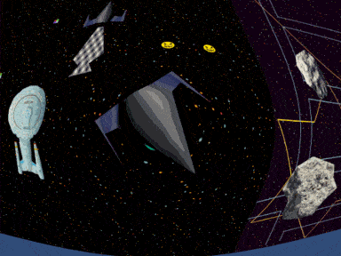

# Comets

## Currently looks like this
 
Minus the lossy compression.
## What is this?
A heavily work-in-progress, open world, networked multiplayer remake of [Asteroids](https://en.wikipedia.org/wiki/Asteroids_(video_game)),
mostly inspired by [Comet Busters](https://archive.org/details/CometBusters14Image), which, in our humble opinion, was and still is the pinnacle of Windows gaming.
The server - including the network layer - is custom C++ code, built from scratch, on top of UDP sockets.
It's crafted with extensibility and performance in mind. With adaptive space partitioning algorithms to boost collision and visibility checks,
and with specialized data structures optimized for memory locality, it will hopefully be able to simulate tens of thousands of dynamic game objects.
## Current development environment
* Microsoft Visual Studio Community 2017 Version 15.9.17
* Microsoft .NET Framework Version 4.7.03056
* Unity 2017.3.1f1
* Blender 2.79b
## Minimal development environment that worked at some point
* Microsoft Visual Studio Community 2017 Version 15.7.3
* Microsoft .NET Framework Version 4.7.03056
* Unity 2017.3.1f1
* Blender 2.79b
